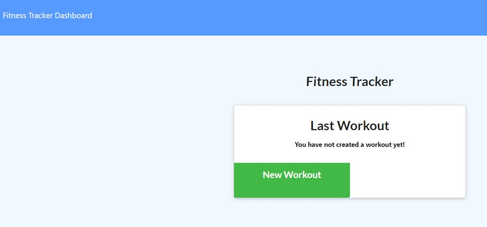

# 17 - Workout Tracker

## Description

Using Express, Mongoose, and Mongodb, this app will allow the user to track their workouts allowing them to enter current workouts, enter data from both cardio and strength training, and allows for multiple types of workouts.  

### Screenshot

#### Link to Deployed Application
[Github Link](https://github.com/scotwoodland/Workout_Tracker) is hosted on Github pages.
[Deployed URL Link](https://fierce-mesa-55414.herokuapp.com/) is hosted on Heroku.

This application was authored by Scot Woodland.
